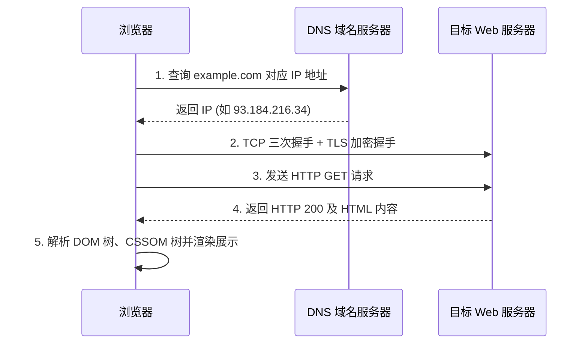

# 计算机网络：从输入 URL 到页面展示

这是一道最经典也是最能串联计算机体系知识的全链路思考题。

---

## 1. 经典生命周期拆解

当你在浏览器地址栏敲下 `https://example.com/index.html` 并按下回车的一刹那，系统底层发生了以下事情：

---

## 2. 核心网络分层协议

- **应用层**：HTTP/HTTPS, DNS, SSH, FTP
- **传输层**：TCP（面向连接、可靠有序、拥塞控制）、UDP（无连接、尽最大努力交付、低延迟）
- **网络层**：IP 协议、ICMP、路由寻址与转发
- **网络接口层**：以太网、MAC 帧、ARP 地址解析
