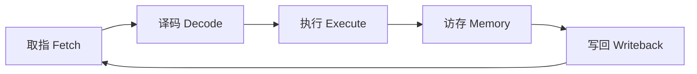

# 数字电路基础：从晶体管到 CPU

> “量变最终引发质的飞跃”，这句话在计算机体系结构中被不断验证。当我们敲下键盘，注视着屏幕时，可以试着想象：在极其微小的硅基深处，此刻正有百亿级极小的晶体管，在电光火石之间拼尽全力进行着精密的协同。这或许就是最独特的计算机科学之美。

## 0. 全景图：从沙子到智能

计算机的物理本质是**用电信号表示与处理信息**：
1. **沙子（二氧化硅）** 经过提纯提炼成单晶硅棒。
2. 制造出具备开关特性的**半导体晶体管 (MOSFET)**。
3. 由晶体管组合成基本的**逻辑门电路**（与、或、非、异或）。
4. 逻辑门组合成**功能部件**（加法器、寄存器、译码器、ALU）。
5. 最终集成构建出能够执行指令序列的 **中央处理器 (CPU)**。

---

## 1. 晶体管：数字世界的开关

### 1.1 晶体管概述

现代集成电路中最普遍的晶体管是 **场效应管 (MOSFET)**。你可以将其简单地理解为一个受电压控制的微型“自来水龙头”：
- **高电平（比如 1.2V）**：阀门打开，导通（代表二进制状态 `1`）。
- **低电平（比如 0V）**：阀门关闭，截止（代表二进制状态 `0`）。

### 1.2 晶体管数量的演进

著名摩尔定律（Moore's Law）预测芯片上的晶体管数量大约每 18~24 个月翻一番。

| 发展时代 | 代表芯片 | 晶体管数量 | 工艺制程 |
| :--- | :--- | :--- | :--- |
| 1971 年 | Intel 4004 | 约 2,300 | 10 微米 |
| 1989 年 | Intel 486 | 约 120 万 | 1 微米 |
| 2000 年 | Pentium 4 | 约 4,200 万 | 180 纳米 |
| 现代 (2024+) | Apple M3 Max / 旗舰 GPU | 超 900 亿 | 3 纳米 |

---

## 2. 逻辑门：用开关做运算

多个晶体管相互连接，就可以实现最基础的布尔代数运算：

### 2.1 常见逻辑门介绍

- **非门（NOT Gate）**：输入反转，`0 -> 1`，`1 -> 0`。
- **与门（AND Gate）**：所有输入都为 1 时，输出才为 1。
- **或门（OR Gate）**：只要有一个输入为 1，输出即为 1。
- **异或门（XOR Gate）**：输入不同时为 1，输入相同时为 0（这是二进制加法的核心！）。

### 2.2 用逻辑门实现 1 位半加器

当我们在硬件中相加两个二进制位 $A$ 和 $B$ 时：
- **本位和 (Sum)**：$S = A \oplus B$（异或门）
- **进位 (Carry)**：$C = A \cdot B$（与门）

```verilog
// 1位半加器的 Verilog HDL 描述示例
module half_adder (
    input  wire a,      // 加数 A
    input  wire b,      // 加数 B
    output wire sum,    // 本位和
    output wire carry   // 进位输出
);
    assign sum   = a ^ b;  // 异或门计算和
    assign carry = a & b;  // 与门计算进位
endmodule
```

::: tip 思考题
为什么有了异或门和与门，计算机就能够做更复杂的乘法和除法运算？
:::

---

## 3. 功能单元：逻辑门的组合

通过成百上千个逻辑门的互联组合，我们可以搭建出具有特定功能的电路单元：

1. **算术逻辑单元 (ALU)**：执行加、减、位运算等核心运算。
2. **锁存器与触发器 (Flip-Flop)**：利用反馈环路在电路中保存 1 位电平状态，这是**内存与寄存器**的起源。
3. **寄存器组 (Register File)**：CPU 内部速度最快、延迟最低的临时存储空间。

---

## 4. CPU 架构：从功能单元到指令执行

中央处理器本质上是一个在时钟信号（Clock）驱动下的状态机，周而复始地执行以下步骤：



---

## 延伸阅读

如果你对底层技术充满好奇，可以尝试在以下几个方向继续探索：

- **经典教材**：《计算机组成与设计（硬件/软件接口）》是深入学习体系结构的一本很好的参考书。
- **数字逻辑仿真**：尝试使用逻辑仿真软件或基础元器件，动手搭建一个简单的 8 位加法器或模拟器。
- **体系结构前沿**：了解多级缓存如何缓解“内存墙”问题、指令乱序执行的原理，以及 GPU 的特殊运算机制等。
- **底层与汇编语言**：尝试学习一些基础汇编语言，理解高级语言最终是如何被转化为机器可以执行的十六进制指令的。
