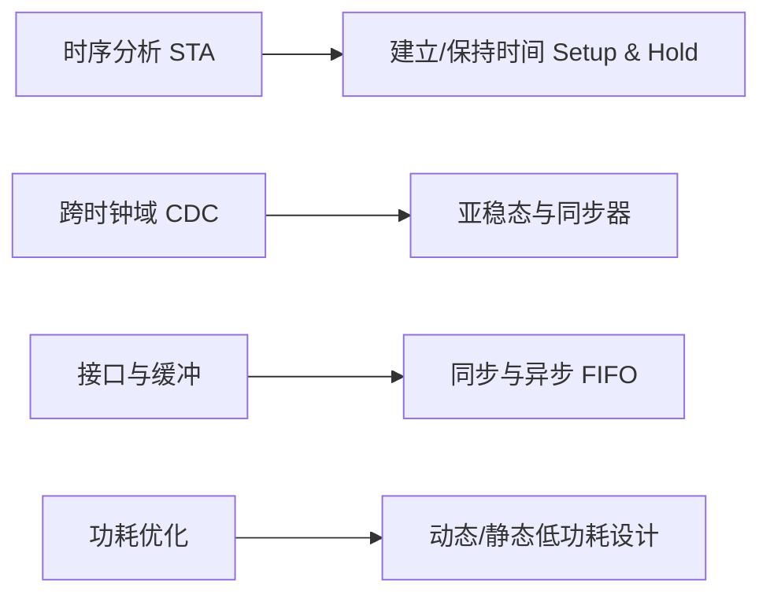

# 数字 IC 核心基础八股集锦

收录数字集成电路（Digital IC）前端设计、FPGA 开发与芯片架构求职面试中最核心的高频八股考点。

---

## 📌 核心知识板块

- **[01. 静态时序分析 (STA) 与建立/保持时间](./01-sta-timing.md)**：Setup/Hold Time 概念、计算公式、违例修复方法、时钟抖动 (Jitter) 与时钟偏斜 (Skew)。
- **[02. 亚稳态与跨时钟域 (CDC) 设计](./02-cdc-metastability.md)**：亚稳态产生机理、MTBF 平均无故障时间、单 bit 信号同步（打两拍/边沿检测）、多 bit 信号同步（格雷码/握手协议）。
- **[03. FIFO 架构设计与反压握手](./03-fifo-design.md)**：同步 FIFO 满空标志生成、异步 FIFO 格雷码指针转换、假满与假空、Ready-Valid 握手协议。
- **[04. 低功耗设计技术 (Low Power)](./04-low-power.md)**：功耗构成（动态功耗、短路功耗、漏电功耗）、门控时钟 (Clock Gating)、操作数隔离、多电源多电压域 (MSMV/DVFS)。

---

::: tip 面试忠告
八股不仅要“背过”，更要结合具体的电路图与时序波形，理解其在真实物理硅片上的物理意义。
:::
