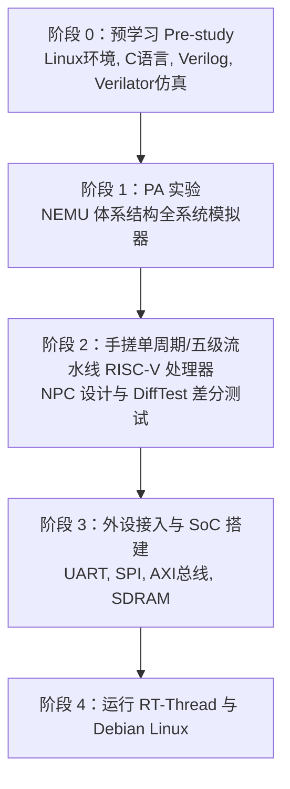

# “一生一芯” 学习全记录

中国科学院大学“一生一芯”计划（OSCPU），旨在通过贯穿计算机体系结构、模拟器开发（NEMU）、RISC-V 处理器硬件设计（NPC）、仿真验证（Verilator / NVBoard）到最终流片的全流程培养。

---

## 🗺️ 阶段路线规划

---

## 📑 章节导航

- **[01. 预学习阶段总结](./01-pre-study.md)**：Linux 环境搭建、C 语言指针强化、NVBoard 虚拟实验台、Verilator 仿真双轨验证。
- **[02. PA (Programming Assignment) 模拟器](./02-pa.md)**：深入实现 NEMU、指令译码执行、简易调试器 sdb、内存映射与反汇编。
- **[03. NPC (New Processor Core) 硬件设计](./03-npc.md)**：手搓 RV32E / RV32I 处理器，单周期到五级流水线，分支预测与总线对接。

---

::: tip 一生一芯格言
“自己动手实现过一遍的东西，才真正属于你自己。”
:::
